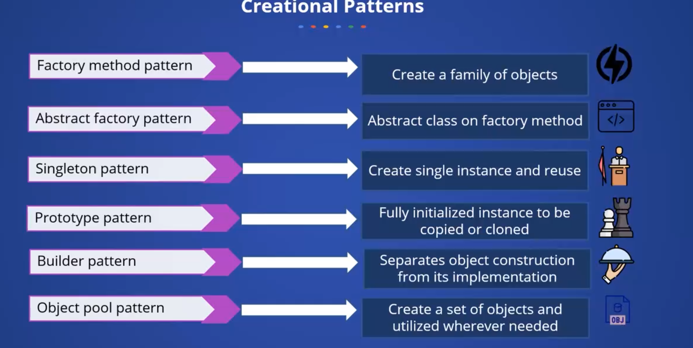

# Words:
- Subscription: Đăng Ký 
- Respective: Tương ứng
- Concrete: Cụ thể
- Instantiation: Khởi tạo
- Observe: Quan sát, nhìn ra, nhận thấy 
- Ingredients: Thành phần
# Overview
- After completing this course, you should be able to understand the following:
  - The fundamental principles and types of design patterns in Java, including:
    - Creational -> Factory Method, Singleton, and Builder
    - Structural -> Adapter, Bridge, and Facade
    - Behavior patterns
  - Advanced Design Patterns such as Chain Responsibility, Command and Observer.

# Introduction
- Design pattern là một loại khái niệm, best practices thường được dùng trong các phần mềm phát triển hướng đối tượng
  - Giúp cho bạn có thể viết code more flexible, extensible, re-usable, maintainable and better performance.
- Entire Java
  - Design pattern are categorized into two parts
    - Core Java design patterns
    - J2EE design patterns. 
# Types of Design patterns
- There are three basic design patterns basic to your core Java.
  - Creational
  - Structural
  - Behavior
# Creational Patterns
- 
# Factory Method Pattern
- 
# Singleton Design Pattern 
- Define a class that has only instance and provide global point acc ess.
- A class ensure that it has only one single instances of it.
- There could be `two types of singleton design pattern`:
  - `One is easy instantiation` -> create in load object
  - `Lazy instantiation.` -> create base on demand and ad-hoc
- To create a singleton design pattern.
  - We need to have a private constructor and a static factory method. 
- Why we need private constructor?
  - We prevent to instantiation single instance class from outside a class.
- Why we need a static member?
  - Like I said, static gets memory copy only once.
- Usage:
  - configuration
  - multi-threading
  - database connection
  - caching
  - logging
  - thread-pool
# Builder Pattern 
