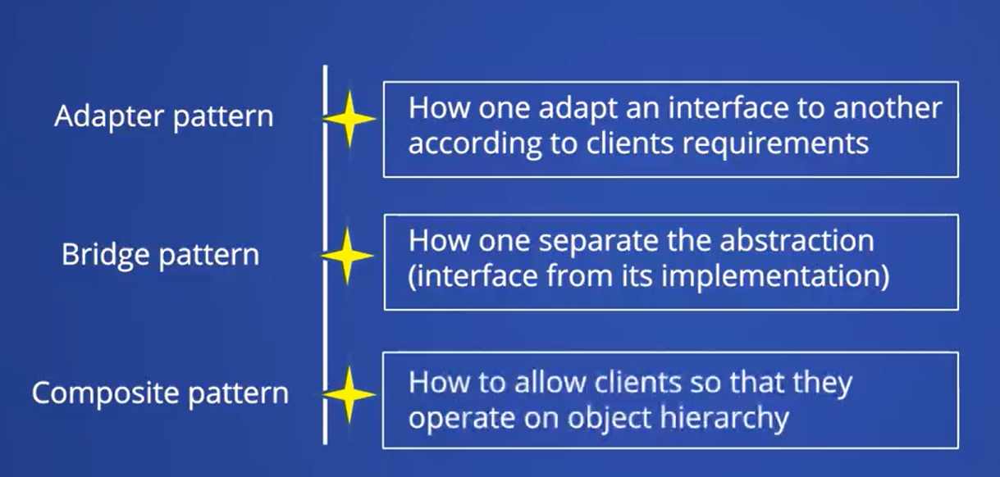
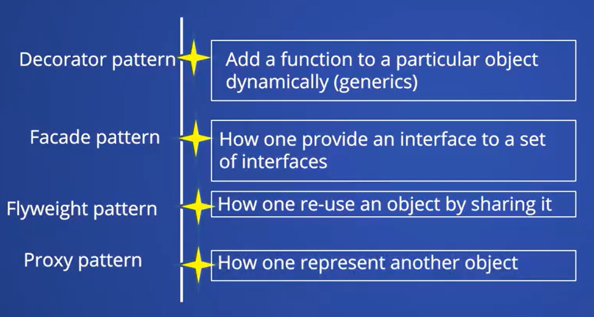

# Words:
- Subscription: Đăng Ký 
- Respective: Tương ứng
- Concrete: Cụ thể
- Instantiation: Khởi tạo
- Observe: Quan sát, nhìn ra, nhận thấy 
- Ingredients: Thành phần
# Overview
- After completing this course, you should be able to understand the following:
  - The fundamental principles and types of design patterns in Java, including:
    - `Creational` -> `Factory Method, Singleton, and Builder`.
    - `Structural` -> Adapter, Bridge, Facade, Composite, Decorator, Flyweight, Proxy pattern.
    - `Behavior` patterns
  - Advanced Design Patterns such as Chain Responsibility, Command and Observer.

# Introduction
- Design pattern là một loại khái niệm, best practices thường được dùng trong các phần mềm phát triển hướng đối tượng
  - Giúp cho bạn có thể viết code more flexible, extensible, re-usable, maintainable and better performance.
- Entire Java
  - Design pattern are categorized into two parts
    - Core Java design patterns
    - J2EE design patterns. 
# Types of Design patterns
- There are three basic design patterns basic to your core Java.
  - Creational
  - Structural
  - Behavior
# Creational Patterns
- 
# Factory Method Pattern
- 
# Singleton Design Pattern 
- Define a class that has only instance and provide global point acc ess.
- A class ensure that it has only one single instances of it.
- There could be `two types of singleton design pattern`:
  - `One is easy instantiation` -> create in load object
  - `Lazy instantiation.` -> create base on demand and ad-hoc
- To create a singleton design pattern.
  - We need to have a private constructor and a static factory method. 
- Why we need private constructor?
  - We prevent to instantiation single instance class from outside a class.
- Why we need a static member?
  - Like I said, static gets memory copy only once.
- Usage:
  - configuration
  - multi-threading
  - database connection
  - caching
  - logging
  - thread-pool
# Builder Pattern 
- Builder pattern là mẫu thiết kế giúp xây dựng một đối tượng phức tạp. Thay vì truyền tất cả các tham số vào constructor ngay lập tức, nó cho phép bạn thêm từng thuộc tính theo cách linh hoạt.
- Nó thường được dùng khi một đối tượng có nhiều thuộc tính, không phải lúc nào cũng cần tất cả. Ví dụ, nếu tôi làm một lớp Coffee với loại cà phê, đường, sữa, kích thước, thì thay vì viết `nhiều constructor khác nhau`, tôi dùng `Builder` để chọn từng thứ: 'mocha, có sữa, không đường, ly lớn'. Cuối cùng, tôi gọi `build()` để tạo đối tượng.
- Tại sao nên dùng Builder Pattern? 
  - Dễ đọc
  - Linh hoạt
  - Tách biệt được quá trình xây dựng đối tượng ra khỏi lớp chính -> dễ bảo trì và thay đổi
- Khi nào nên dùng? 
  - Khi đối tượng có nhiều thuộc tính và không phải khi nào cũng cần hết.
  - Muốn code dễ đọc và dễ mở rộng.
  - Muốn tạo đối tượng bất biến.
# Structural Pattern 

# Adapter Pattern 
- To make the `interface` of a class compatible with another `interface`